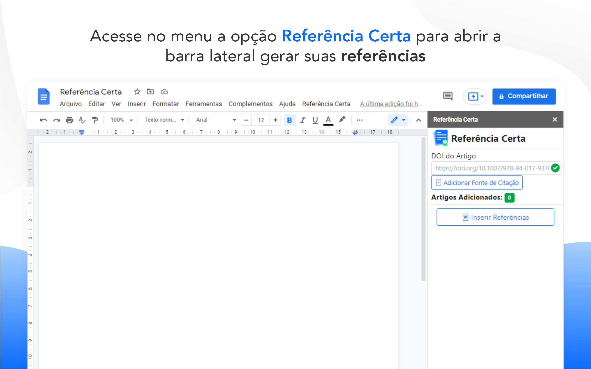
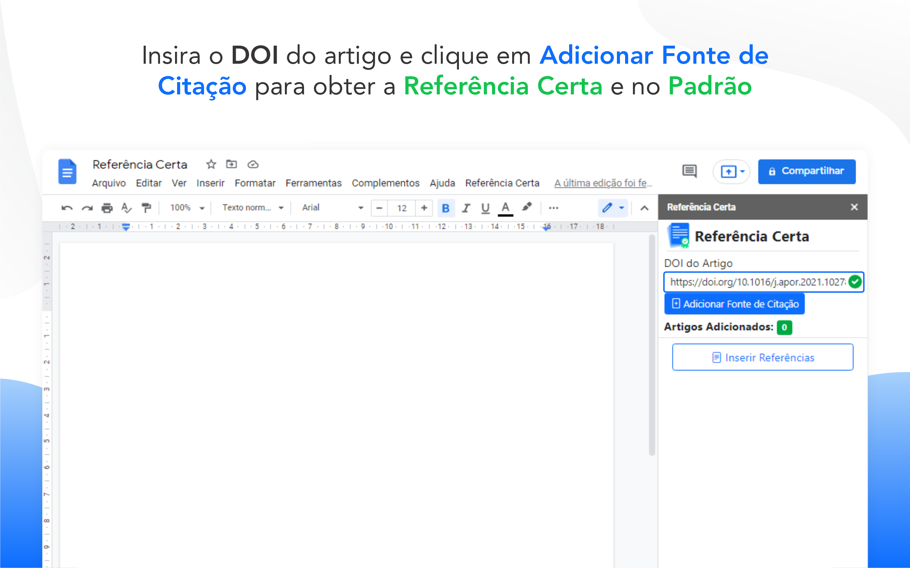
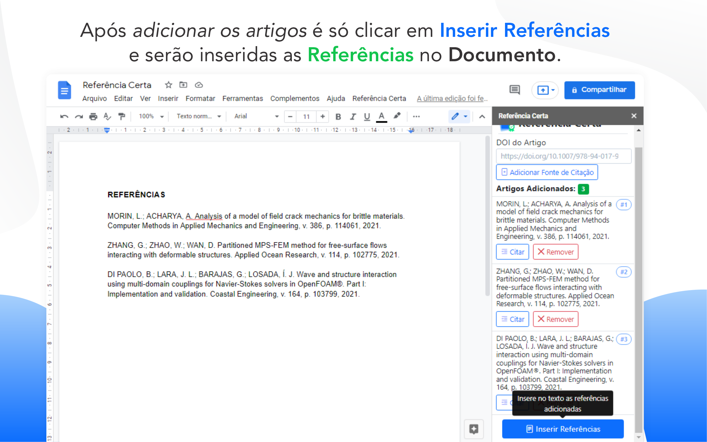
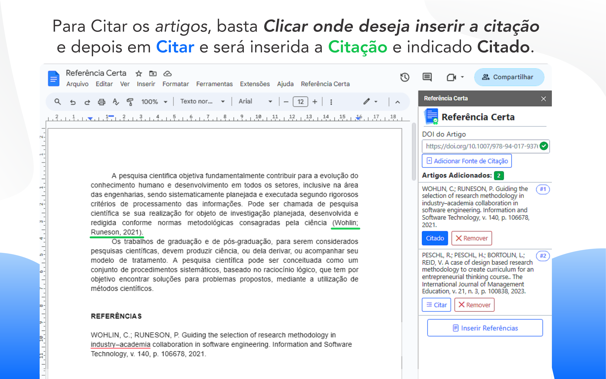

Faça seu trabalho acadêmico com as referências corretas sem as complicações da ABNT! O Complemento Referência Certa foi criado para que você possa usar o Google Documentos™ para criar seus trabalhos acadêmicos e inserir as referências bibliográficas seguindo a norma ABNT sem complicação nem gastar tempo nenhum. Com o Referência Certa vai inserindo o DOI das referências que deseja citar no seu trabalho e depois que concluir é só clica em Inserir Referências e está feito.

